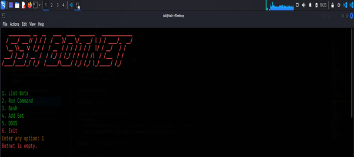

# ssh_botnet
This project is a Python-based SSH Botnet management tool designed to remotely manage multiple bots from a single control interface. It enables system administrators and security researchers to automate tasks, run commands across multiple machines, and simulate network testing in a controlled environment.

# Tools and Libraries used:
1. Programming Language
• Python 3 – Core language used to develop the botnet management system.
2. Python Libraries
i. pexpect / pxssh
o Used for automating SSH login and executing commands remotely.
o Provides a secure way to connect to remote devices without
manually typing credentials.
ii. scapy
o A powerful packet crafting and manipulation tool.
o Used here for sending network packets in loops.
iii. json (built-in)
o Used for saving and loading the botnet list persistently into a JSON
file.
o Allows the system to remember bots even after restarting.
iv. colorama
o Adds colors to terminal outputs (e.g., success in green, errors in red).
o Improves readability of the menu and status messages.
v. sys and os
o sys: Used for exiting the program gracefully.
o os: Used for system operations.
3. Supporting Tools
• SSH (Secure Shell Protocol) – Required for remote device connection.
The project assumes that all bots have SSH enabled.
• Linux Terminal / Command Prompt – To run the Python script.
• JSON File– Used as a storage file for the list of bots.
4. Optional Tools for Testing
• Virtual Machines like VirtualBox or VMware for creating multiple test
bots.
• Test Network Setup for safe DDOS packet testing.
# Methodology :
1. Problem Identification
• Managing multiple remote systems manually can be time-consuming and
inefficient.
• There is a need for a centralized tool to connect, control, and execute
commands on multiple devices simultaneously.
• Network security testing (e.g., stress testing) also requires a controlled
method of sending test packets.
2. System Design
The system is designed as a centralized controller that connects to multiple
remote devices (bots) over SSH and executes commands.
• Input: SSH credentials of bots, user commands, or network target details.
• Process: Establish SSH sessions, execute commands or packet floods.
• Output: Remote command outputs or test packets sent to the target.
3. Implementation Steps
Step 1: Botnet Initialization
• Load existing bot details from a JSON file (botnet.json).
• Attempt to reconnect to all saved bots using SSH.
Step 2: Menu-Driven Interface
• Display a user-friendly interface with options:
1. List Bots
2. Run Command
3. Bash
4. Add Bot
5. DDOS
6. Exit
Step 3: Adding Bots
• Accept IP address, SSH port, username, and password from the user.
• Establish SSH connection using pxssh and add the bot to the botnet list.
• Save updated botnet list in the JSON file.
Step 4: Command Execution
• User enters a command (or interactive bash).
• Command is sent to all connected bots.
• Each bot’s response is displayed in the console.
Step 5: Network Packet Testing
• Using Scapy, create custom TCP SYN packets.
• Send packets continuously to a target IP/port to test the network’s response.
Step 6: Persistent Storage
• Before exiting, bot details are saved in botnet.json for future use.
4. Tools & Libraries
• pxssh: For SSH automation.
• scapy: For packet creation and sending.
• json: For persistent storage.
• colorama: For user interface enhancement.
5. Testing & Validation
• Test in a controlled environment with multiple test machines or VMs.
• Validate that:
o Bots connect successfully.
o Commands are executed correctly on all bots.
o Packet sending works as expected without affecting unintended
systems.

# Conclusion :
This project successfully demonstrates the development of a centralized botnet management system capable of connecting to multiple devices via SSH, executing commands remotely, and performing network testing using packet generation techniques. By combining libraries like pxssh and scapy, the tool provides a robust and automated way to manage remote systems efficiently.
It highlights the importance of automation in system administration and network testing while emphasizing the need for ethical use in controlled environments. With further enhancements such as advanced logging, encryption, and a graphical interface, the system can evolve into a more powerful and user-friendly administration tool.
